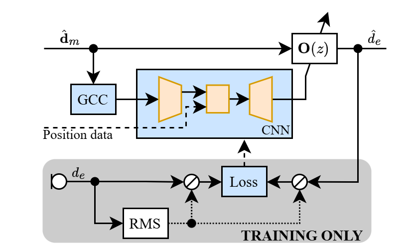

# Deep Observation Filter

This repository contains code to train, validate, and evaluate a neural network-based observation filter for virtual sensing in local active noise control. This approach is submitted at the Forum Acusticum 2025 in Malaga, Spain.

## Background

The remote microphone technique (RMT) [1] is a widely used technique in active noise control to estimate the error signal at a virtual error microphone at the point of cancellation using nearby remote microphones. The key component is the so-called "observation filter", which estimated the primary disturbances at the virtual error microphone.

The observation filter is usually calculated in advance using a least-squares approach. However, this approach has several limitations, such as the need for a priori knowledge of the primary source and the assumption of a stationary environment. To overcome these limitations, we propose a lightweight neural network-based observation filter that can adapt to changing environments. The network is based on an encoder-decoder like structure using convolutional layers. It computes the filter coefficients for the observation filter based on the GCC-PHAT [2] between all remote microphones as well as the coordinates of the virtual error microphone.

The model itself has about 366k parameters and requires 1.34M operations per pass. Inference can run asynchronously to the actual filter operation. The observation filter itself is implemented using the overlap-save method to save computational resources.

Trained and evaluated for 1000 epochs on an anechoic dataset with 50000 samples à 10 s with a single primary source and randomized source positions, primary disturbance characteristics, and virtual microphone position, a broadband normalized mean square error of -33.5 dB was achieved. Towards low frequencies, an estimation error of about -50 dB is reached. Training was done on a single NVIDIA RTX 3080 GPU and took about 16 hours.

## Usage

The code is written in Python and uses the PyTorch library. The dataset is generated using the `pyroomacoustics` library in the file `generate_anaechoid_signals.py`, based on settings in the config file `configs/FA_datagen_varpos_sph.toml`.

Training and validation of the neural network are done in `train_O_singlesource_noise_anaechoic.py`. All relevant parameters are defined in configs files, see e.g. `configs/FA_varpos_singlesource*.toml`.

The evaluation of the observation filter is done in `evaluate_O_singlesource_noise_anaechoic.py`, based on results on the validation set.

## License

This code is licensed under the MIT License.

## References

[1] A. Roure and A. Albarrazin, “The remote microphone technique for active noise control,” in INTER-NOISE 1999, (Fort Lauderdale FL, USA), pp. 1233–1244, Dec. 1999.

[2] C. Knapp and G. Carter, “The generalized correlation method for estimation of time delay,” IEEE Trans. Acoust., Speech, Signal Process., vol. 24, pp. 320–327, Aug. 1976.